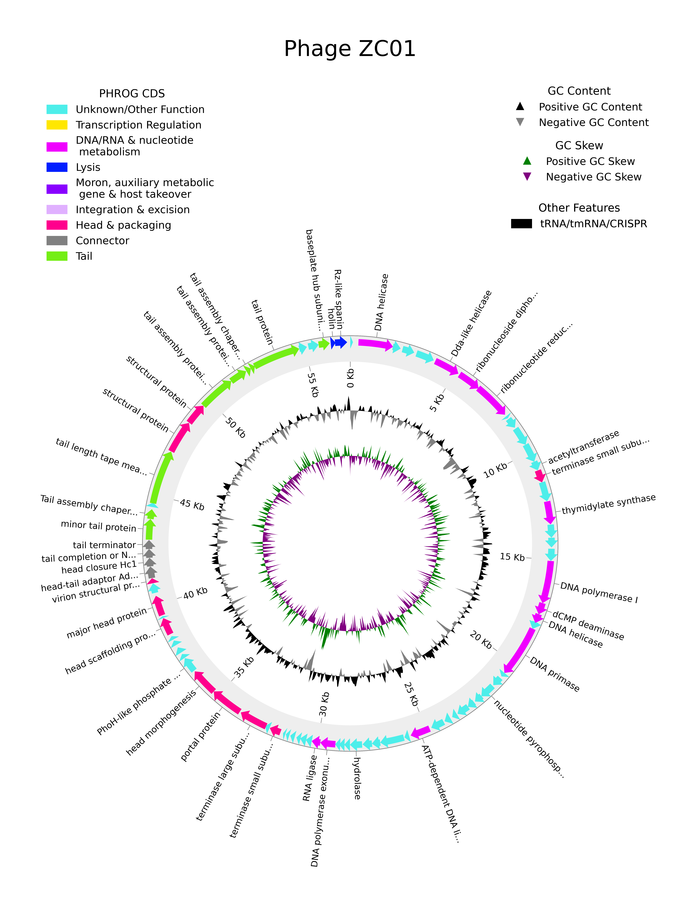

# PhageComparativeGenomics
### dataset for use
The provided dataset comprises the viral genus Abidjanvirus and Phifelvirus, with 6 and 7 genomes of complete phages respectively  
File --> `examples.fasta`

First, lets understand our dataset of phages. We have in total 13 phage genomes from 2 families.  

Lets create a simple table contaning phage ID, genome size and GC% content.  

>**Warning**
>Before starting please install Biopython --> `pip3 install biopython`  

```python
import pandas as pd
from Bio import SeqIO
from Bio.SeqUtils import GC
import os

#Lets create one variable with the full path for the folder contaning our data and one with the full path to the fasta file

fasta_folder = "path/to/folder/"
fasta_file = "path/to/folder/examples.fasta"

#Before starting to collect information we should create a variable to store the data. Here we will create an empty list.

phage_metadata = []

#Now lets create a loop, that will iterate through our file and get the genome size and GC information to store in our phage_metadata list variable

for phage in SeqIO.parse(fasta_file, "fasta"):
    phage_metadata.append([phage.id, len(str(phage.seq)), GC(phage.seq)])

#Lastly we can create a dataframe and save as a csv/tsv file

phage_dataframe = pd.DataFrame.from_records(phage_metadata, columns=["Phage ID", "Genome len", "GC%"])

#Sorting data
phage_dataframe.sort_values(by="GC%", ascending=False, inplace=True)

#Before saving lets create a variable with the desired output path and file name
metadata_output = os.path.join(fasta_folder, "Phage_metadata.tsv")

#Saving data
phage_dataframe.to_csv(metadata_output, index=False)
```
As a result we have:  

|               Phage ID              | Genome len |    GC%    |
|:-----------------------------------:|:----------:|:---------:|
|       Pseudomonas_phage_PaMx11      |    59878   | 64.452721 |
|   Pseudomonas_phage_AIIMS-Plu-RaNi  |    46647   | 64.452162 |
| Pseudomonas_phage_vB_PaeS_PAO1_Ab18 |    56537   | 63.498240 |
| Pseudomonas_phage_vB_PaeS_PAO1_Ab20 |    57745   | 63.475626 |
|        Pseudomonas_phage_ZC01       |    57061   | 63.391809 |
| Pseudomonas_phage_vB_PaeS_PAO1_Ab19 |    58139   | 63.303462 |
|      Enterococcus_phage_phiFL2A     |    36270   | 34.607113 |
|      Enterococcus_phage_phiFL2B     |    36826   | 34.573399 |
|      Enterococcus_phage_phiFL3A     |    39576   | 34.546190 |
|      Enterococcus_phage_phiFL3B     |    40275   | 34.497827 |
|      Enterococcus_phage_phiFL1C     |    38721   | 34.022882 |
|      Enterococcus_phage_phiFL1A     |    38764   | 34.013518 |
|      Enterococcus_phage_phiFL1B     |    38989   | 33.978815 |  


This is a simple example of what can be done as preliminary/exploratory analysis for phage genomes.  

For CDS prediction and annoatation, both tools [PROKKA](#prokka-cds-prediction-and-annotation) and [Pharokka](#pharokka-cds-prediction-and-annotation) requires a fasta file for each genome analyzed, so we will split the file **examples.fasta** in 13 fasta files.  

```python
import pandas as pd
from Bio import SeqIO
import os

#Lets create one variable with the full path for the folder contaning our data, one with the full path to the fasta file and one with the full path for the excel file

fasta_folder = "path/to/folder/"
fasta_file = "path/to/folder/examples.fasta"

#Now lets create a loop, that will iterate through our file and create new files for each genome
for phage in SeqIO.parse(fasta_file, "fasta"):
    sequence = str(phage.seq)
    id = phage.id
    phage_name = id
    #Before saving lets create a variable with the desired output path
    output = os.path.join(fasta_folder,f"{phage_name}.fasta")
    with open(output, "w") as file:
        file.write(f">{id}\n{sequence}\n")
```

With that done we can start our analysis.  
## CDS prediction

### PROKKA CDS prediction and annotation

First visit the [Prokka](https://github.com/tseemann/prokka) github page to install it.  

#### Database download and formating

Then, lets download the [PHROGS](https://phrogs.lmge.uca.fr/) database.  

```bash
#Downloading the database
wget https://phrogs.lmge.uca.fr/downloads_from_website/MSA_phrogs.tar.gz
#Unzip the downloaded folder
tar -xvzf MSA_phrogs.tar.gz
#Enter the folder and generate hmm profiles from the alignment (MSA) files (this takes a few minutes)
cd MSA_Phrogs_M50_FASTA
for i in *.fma;do base_name=${i%%.*}; hmmbuild ${base_name}.hmm $i;done
#With that done we concatenate all .hmm files
cat *.hmm > PHROGS.hmm
#Generate HMMER database files
hmmpress PHROGS_db.hmm

#Lastly, we will download the annotation table to use later
wget https://phrogs.lmge.uca.fr/downloads_from_website/phrog_annot_v4.tsv
```
>With that done we will have four files created:
>Models pressed into binary file:   PHROGS.hmm.h3m  
>SSI index for binary model file:   PHROGS.hmm.h3i  
>Profiles (MSV part) pressed into:  PHROGS.hmm.h3f  
>Profiles (remainder) pressed into: PHROGS.hmm.h3p  

>**Note**  
>With the step above finished, all the input and intermediate files can be deleted  
>`rm *.fma` and `rm phrog_*.hmm`  
>With this, the final files sums 7GB of storage  

The resulting database should be in the folder **~/MSA_Phrogs_M50_FASTA/PHROGS.hmm**  
#### PROKKA run

In this step we will start the gene identification and annotation usig PROKKA 
To get easy to understand and manipulate output files we will use the *--locustag* and *--prefix* flags with the same value, the phage ID!  

***IMPORTANT: We are working with viral genomes, reameber to use the --kingdom flag with 'Viruses' as value!***  

1. Simple run:
```bash
prokka --locustag ZC01 --prefix ZC01 --kingdom Viruses --fast ZC01.fasta
```
2. We can also predict all genes from all phages with a single *for loop*:  
```bash
for file in *.fasta;do phage_id=${file%%.*}; prokka --locustag $phage_id --prefix $phage_id --kingdom Viruses --fast $file;done
#After gene prediction we can recover all *.faa files to a single folder
mkdir CDS_folder
find . -name '*.faa' -exec cp --target-directory=CDS_folder {} \;
```
>**Warning**  
>The *find* command will look for all *.faa files in the current folder, if you have other *.faa files they will also be copied to the CDS_folder folder  

#### Annotation with PHROGS

For the annotation of all CDS predicted we will use the previously generated HMM [database](#database-download-and-formating)  

Like in the PROKKA step, we can run the analysis for all .faa files at a *for loop*:  
>**Note**  
>After all program options we provide (in this order) the hmm database (~/MSA_Phrogs_M50_FASTA/PHROGS.hmm) and the file to be annotated  

```bash
#First lets navigate to the CDS_folder
cd CDS_folder
#Now we will create the loop
for file in *.faa;do phage_id=${file%%.*}; hmmscan -o ${phage_id}.out.PHROGS --tblout ${phage_id}.hmm.results --noali -E 1e-5 ~/MSA_Phrogs_M50_FASTA/PHROGS.hmm $file;done
```
With that done, we will parse the results using python:  
```python
import pandas as pd
import os

hmm_results_folder = "path/to/.hmm.results"
annot_table_path = "path/to/downloaded/phrog_annot_v4.tsv"

annot_table = pd.read_table(annot_table_path,dtype=str)

for result in os.listdir(hmm_results_folder):
    if result.endswith(".hmm.results"):
        #First lets get the id for all predicted CDS
        phage_id = result.split(".")[0]
        faa_file = os.path.join(hmm_results_folder, f"{phage_id}.faa")
        ids_list = [IDs.id for IDs in SeqIO.parse(faa_file, "fasta")]
        cds_df = pd.DataFrame({"Query Name": ids_list})

        #Now we will create the hammer results dataset
        hmmer_header = ["Target Name", "Query Name", "E-value", "Score", "Bias"]
        data = os.path.join(hmm_results_folder, result)
        hmmer_df = pd.read_csv(data, comment="#", delimiter=r"\s+", names=hmmer_header, usecols=[0,2,4,5,6])
        hmmer_df.sort_values(by="E-value", ascending=True, inplace=True)
        hmmer_df.drop_duplicates(subset="Query Name" ,keep="first", inplace=True)
        hmmer_df["index"] = hmmer_df.apply(lambda x: int(x["Query Name"].rpartition("_")[2]), axis=1)
        hmmer_df.sort_values(by="index", inplace=True)
        hmmer_df["phrog"] = hmmer_df["Target Name"].apply(lambda x: x.replace("phrog_", ""))
        
        #And join with the annotation table by the "phrog" column
        anntoated_df = pd.merge(hmmer_df, annot_table, on="phrog", how="left")

        #lastly, join with the CDS ids, and fill the missing values with "Hypothetical protein"
        anntoated_df = pd.merge(cds_df,anntoated_df, on="Query Name", how="left").fillna({"color": "#c9c9c9", 
                                                                                          "annot": "Hypothetical protein", 
                                                                                          "category" : "unknown function"})
        #Generating a table for each annotated phage genome -- We will save the annotation tables in the hmm results folder
        output_table = os.path.join(hmm_results_folder, f"{phage_id}.annot.tsv")
        anntoated_df.to_csv(output_table, sep="\t", index=False)
```
>**Note**  
>The *"color"* columns will be important later for genomic visualization  


### Pharokka CDS prediction and annotation

Pharokka can be easily installed using conda. We recommend creating a conda enviroment first.  

```bash
conda create -n pharokka-env
conda activate pharokka-env

conda install -c bioconda pharokka -y

#After instalation install all databases from the pharokka directory
#To easily find the pharokka directory:

which pharokka.py

#Go to the pharokka directory
cd ~/anaconda3/envs/pharokka-env/bin/

./install_databases.py
```
After installation we are all set to start our phage annotations  

Lets start with a single genome:  

```bash
conda activate pharokka-env

pharokka.py -i ZC01.fasta -t 6 -l ZC01 -p ZC01 -f -o ZC01_pharokka
```
The main output is the ZC01_cds_final_merged_output.tsv, this file contains all of the information about the annotation run, includding all found PHROGs, CARD resistence genes and Virulence genes. 

Pharokka also outputs other important information:  
1. `ZC01_cds_functions.tsv` contains the general inforamtion about the functional categories found  
2. `phanotate.faa` contains all of the predicted **proteins**, found by PHANOTATE  
3. `phanotate.ffn` contains all of the predicted **genes**, found by PHANOTATE  
4. `terL.faa/.ffn` contains (if found) the Terminase Large subunit gene  
5. `ZC01.gbk` contains all of the annotated informatin in the NCBI *GBK* format  
6. `ZC01.tbl` contains all of the annotated informatin in the NCBI *feature table* format  

Like in the [PROKKA](#prokka-cds-prediction-and-annotation) example, we can run a *loop* for all phage genomes  

```bash
for file in *.fasta;do phage_id=${file%%.*}; pharokka.py -i $file -t 4 -l $phage_id -p $phage_id -f -o ${phage_id}_pharokka;done
```
With that done we can recover all of the .faa files  

>**Warning**  
>Pharokka will always generate the output files with the same name *phanotate.faa*  
>To adress that and rename all files for later use we created the sctipt bellow  

From the folder containing all pharokka output folder:  

>**Note**  
>For this script to work, the pharokka output folder **must** contain *_pharokka* in the folder name!  
>The script takes the phage name that comes before *_pharokka* in the folder to rename the *phanotate.faa* files correctly  

```python
import os
import shutil

#First we create the folder that will recieve all of the annotated genomes
#Check if the folder we are about to create already exists and then creates it

main_folder = "path/to/main/folder"

faa_folder = os.path.join(main_folder, "pharokka_faa_output")

if not os.path.exists(faa_folder):
    print(f"folder {faa_folder} dont exist, creating...")
    os.mkdir(faa_folder)

for dir_name in os.scandir(main_folder):
    if dir_name.is_dir():
        if "_pharokka" in dir_name.path:
            dir = dir_name.path.split("/")[-1]
            phage_name = dir.replace("_pharokka", "")
            annotation_path = os.path.join(dir_name.path, "phanotate.faa")
            new_annot_path = os.path.join(dir_name.path, f"{phage_name}.faa")
            print(f"Changing {annotation_path} --> {new_annot_path}")
            #Renaming files
            os.rename(annotation_path, new_annot_path)
            #Moving files
            shutil.copy(new_annot_path, faa_folder)

```

#### Pharokka genome plot

Pharokka provides an easy to use plotting script, for plotting your genome simply run the following command:  

>**Important**  
>It is importante to notice that the *-p* flag **MUST** match the prefix (-p) used in the annotation step  
>Also, the output provided in *-o* **MUST** also be the same as the one already generated in the annotation step  

```bash
pharokka_plotter.py -i ZC01.fasta -t "Phage ZC01" -n ZC01_plot -p ZC01 -o ZC01_pharokka/
```

The resulting plot:  



## ANI and AAI

## Clustering analysis

Clustering of bacteriopahges can be done in two main ways:
1. Using whole genome similarity
2. Using predicted proteome similarity

## Using whole genome similarity
### 1 - Genereting all-against-all blastn

```bash
blastn -query examples.fasta -subject examples.fasta -outfmt "6 qseqid sseqid pident qcovs evalue" > examples_blast.tab
```
The output of this analysis contains all the identity information for pahges in the fasta file, and usally multiple hits for each pair of pahges compared. 

### 2 - Recovering unique *hits* and preparing the data
From the output of the blastn analysis we will calculate the mean identity, coverage and e-value.
Also, if any hit doesnt reach the thresholds of 80% coverage and 1e-5 e-value, their identity values are zeroed out.  


```python
import pandas as pd
import numpy as np

# Getting the data, grouping by query id and subject id followed by calcualtion of mean for each feature
data = pd.read_table("examples_blast.tab", names=["query", "subject", "ident", "cov", "evalue"]).groupby(["query", "subject"]).agg({"ident":"mean", "cov": "mean", "evalue":"mean"}).reset_index()

# Zeroing out any hit bellow the stablished threshold

data["ident"] = np.where((data["cov"] < 80.0) | (data["evalue"] > 1e-5), 0, data["ident"])

# keeping only the necessary information (query id, subject id and identity)

data = data[["query","subject","ident"]]

# Saving the dataset

data.to_csv("examples_blast.mean.tab", sep=" ", index=False, header=False)
```
### 3 - Clustering the data using MCL
This step will use the *examples_blast.mean.tab* generated before as input for the MCL commands.  
1. mcxload
```bash
mcxload --stream-mirror -abc examples_blast.mean.tab -o examples.mci -write-tab examples.mci.tab
```

Here, all the necessary entry files are generated from the *examples_blast.mean.tab*  

2. mci

```bash
mcl examples.mci -I 2 -use-tab examples.mci.tab -o examples.cluster -te 8
```

Here we generate the final whole genome based clusters. The output is a simple .txt file in which each line is a cluster, and contains all the pahges in the cluster separetd by tab (\t)

### 4 - Retrieving cluster information and plotting

From the mci output *examples.cluster* and input *examples_blast.mean.tab* we will generate a dataframe in python and from this generate a vizualization in python  

```python
import pandas as pd
import networkx as nx
from pyvis.network import Network
import random

###################################
### Reading cluster information ###
###################################

tmp_cluster_list = []
count = 1

with open("examples.cluster", "r") as c:
    for row in c:
            splitted_row = row.strip().split("\t")
            tmp_cluster_list.append([f"cluster{count}", splitted_row])
            count+=1
clusters_df = pd.DataFrame.from_records(tmp_cluster_list, columns=["Cluster", "Phage in cluster"])
clusters_df = clusters_df.explode("Phage in cluster").reset_index(drop=True)

#########################
### Adding some color ###
#########################

## --> The colors generated are random <-- ##

clusters = clusters_df["Cluster"].unique().tolist()

number_of_colors = len(clusters)

color = ["#"+''.join([random.choice('0123456789ABCDEF') for j in range(6)])
             for i in range(number_of_colors)]

cluster_colors = dict(zip(clusters, color))
colors_df = pd.DataFrame.from_dict(cluster_colors, orient="index").reset_index()

colors_df.rename(columns={"index":"Cluster", 0:"color"}, inplace=True)

### Creating the final dataframe with colors ###

with_color_df = pd.merge(clusters_df, colors_df, on="Cluster", how="left")

## Saving data
with_color_df.to_csv("example_clusters_colors.csv", index=False)

## Finishing creating the dictionary to color our network ##

nodes_attr = with_color_df.set_index("Phage in cluster").to_dict(orient="index")

########################
### Plotting Network ###
########################

network_data = pd.read_csv("examples_blast.mean.tab", sep=" ", names=["source", "target", "ident"])

G = nx.from_pandas_edgelist(network_data,
                            source="source",
                            target="target",
                            edge_attr="ident"
                            )
G.remove_edges_from(nx.selfloop_edges(G))
nx.set_node_attributes(G,nodes_attr)

net = Network(notebook=True)
net.from_nx(G)

net.save_graph("examples_network.html")
```

With that done, we now have a interactive network in .html


This rendered network was colored by clsuter, so each color represents a different cluster, the nodes represent all phages analyzed and edges representes how they are conected based on similarity.

## Using predicted proteome similarity

For this analysis we will be using the predicted proteins from the [Annotation](#cds-prediction) step.  

>**Note**
>Prokka generates folder for each annotation, and so we need to recover all the *.faa* files.  
>For this, from the folder where all prokka resulting folder are, we:  
>1. create new folder to hold the data `mkdir predicted_proteins`
>2. copy all files to new folder `find . -name '*.faa' -exec cp --target-directory=predicted_proteins {} \;`
>3. change to the new directory `cd predicted_proteins`
>4. concatenate all files to a single file `cat *.faa > all_proteins.fasta`

### Pre-processing

With that done, we need a way to recover from which phage each protein came from, it will be important later!  
We will keep the same phage names from the fasta headers.  
In python:
```python
import pandas as pd
import os
from Bio import SeqIO
import re
#Copy the path of the predicted_proteins folder

proteins_dir = "path/to/predicted_proteins"

proteins_list = []
for file in os.listdir(proteins_dir):
    if file.endswith(".faa"):
        phage_name = file.replace(".faa", "")
        file_path = os.path.join(proteins_dir, file)
        for f in SeqIO.parse(file_path, "fasta"):
            sequence = str(f.seq)
            protein_header = f.id
            proteins_list.append([phage_name, protein_header, sequence])
proteins_df = pd.DataFrame.from_records(proteins_list, columns=["Phage ID", "Protein ID", "Sequence"])

proteins_df.to_csv("gene_to_genome.tsv", sep="\t", index=False)
```
### Protein Clusters assignment

1. Clsuter assignment 
```bash
cd-hit -i all_phages.fasta -o examples_protein_clusters.out -d 100 -c 0.5 -aL 0.6 -n 2
```

2. Output processing 
```bash
clstr2txt.pl examples_protein_clusters.out.clstr > examples_processed_clusters.tab
```

Now we will do our first clustering step, clsuter all proteins into protein families.
### Distance calculation
In this process we will need the table *gene_to_genome.tsv* generated before, and the *examples_processed_clusters.tab*  

```python
import pandas as pd
import os
import numpy as np
from sklearn.metrics import pairwise_distances
from scipy.cluster.hierarchy import dendrogram, linkage
from Bio import Phylo
from Bio import SeqIO
import re

#Reading cluster data
cluster_out = pd.read_table("examples_processed_clusters.tab")
cluster_out.rename(columns={"id":"Protein ID"}, inplace=True)
cluster_out["ident"] = cluster_out["clstr_iden"].apply(lambda x: x.split("%")[0]).astype(float) #This line will transform the identites (here represented as strings) into float

#Reading gene_to_genome file
gene_2_genome = pd.read_table("gene_to_genome.tsv",usecols=["Phage ID", "Protein ID"])

#Merging datasets
merged_data = pd.merge(cluster_out, gene_2_genome, on="Protein ID", how="left")

#Creating the protein cluster matrix
cluster_matrix = pd.pivot_table(merged_data,index="Phage ID", columns="clstr", values="ident").fillna(0)

#Getting the all-against-all similarity network

#1 transform our matrix into a numpy array
matrix_to_array = cluster_matrix.to_numpy()
#2 Get the labels for later
labels = cluster_matrix.index.tolist()
#3 Lets do the similarity calculation
proteome_sim = 1-pairwise_distances(matrix_to_array, metric="braycurtis")
#4 From the new similarity array, lets transform it back into a network-like table for clustering
#We will use a temporary list (tmp_list) to hold on to our results from the loop
tmp_list = []
for i in range(proteome_sim.shape[0]):
    for j in range(proteome_sim.shape[1]):
        tmp_dict = {"source": labels[i], "target": labels[j], "ident":proteome_sim[i][j]}
        tmp_list.append(tmp_dict)
protein_sim_network = pd.DataFrame(tmp_list)
protein_sim_network.to_csv("examples_proteome_sim_network.tab",
                           sep="\t", index=False) #Lets save our network
```
From this step, we are now able to run the MCI step (just like before) to assing our clsuters  

### Clustering the data using MCL
This step will use the *examples_proteome_sim_network.tab* generated before as input for the MCL commands.  
1. mcxload
```bash
mcxload --stream-mirror -abc examples_proteome_sim_network.tab -o examples_proteome.mci -write-tab examples_proteome.tab
```

Here, all the necessary entry files are generated from the *examples_proteome_sim_network.tab*  

2. mci

```bash
mcl examples_proteome.mci -I 2 -use-tab examples_proteome.tab -o examples_proteome.cluster -te 8
```

Here we generate the final shared-protein based clusters. The output is a simple .txt file in which each line is a cluster, and contains all the pahges in the cluster separetd by tab (\t)

### 4 - Retrieving cluster information and plotting

From the mci output *examples_proteome.cluster* and input *examples_proteome_sim_network.tab* we will generate a dataframe in python and from this generate a vizualization in python  

```python
import pandas as pd
import networkx as nx
from pyvis.network import Network
import random

###################################
### Reading cluster information ###
###################################

tmp_cluster_list = []
count = 1

with open("examples_proteome.cluster", "r") as c:
    for row in c:
            splitted_row = row.strip().split("\t")
            tmp_cluster_list.append([f"cluster{count}", splitted_row])
            count+=1
clusters_df = pd.DataFrame.from_records(tmp_cluster_list, columns=["Cluster", "Phage in cluster"])
clusters_df = clusters_df.explode("Phage in cluster").reset_index(drop=True)

#########################
### Adding some color ###
#########################

## --> The colors generated are random <-- ##

clusters = clusters_df["Cluster"].unique().tolist()

number_of_colors = len(clusters)

color = ["#"+''.join([random.choice('0123456789ABCDEF') for j in range(6)])
             for i in range(number_of_colors)]

cluster_colors = dict(zip(clusters, color))
colors_df = pd.DataFrame.from_dict(cluster_colors, orient="index").reset_index()

colors_df.rename(columns={"index":"Cluster", 0:"color"}, inplace=True)

### Creating the final dataframe with colors ###

with_color_df = pd.merge(clusters_df, colors_df, on="Cluster", how="left")

## Saving data
with_color_df.to_csv("example_proteome_clusters_colors.csv", index=False)

## Finishing creating the dictionary to color our network ##

nodes_attr = with_color_df.set_index("Phage in cluster").to_dict(orient="index")

########################
### Plotting Network ###
########################

network_data = pd.read_csv("examples_proteome_sim_network.tab", sep="\t", names=["source", "target", "ident"])

G = nx.from_pandas_edgelist(network_data,
                            source="source",
                            target="target",
                            edge_attr="ident"
                            )
G.remove_edges_from(nx.selfloop_edges(G))
nx.set_node_attributes(G,nodes_attr)

net = Network(notebook=True)
net.from_nx(G)

net.save_graph("examples_proteome_network.html")
```
With that done, we now have a interactive network in .html


This rendered network was colored by clsuter, so each color represents a different cluster, the nodes represent all phages analyzed and edges representes how they are conected based on similarity.

## UNDER CONSTRUCTION 
