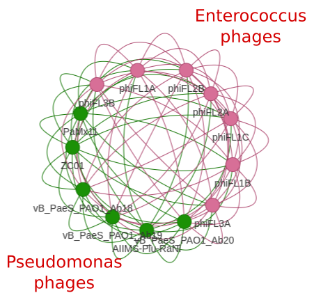

# PhageComparativeGenomics
### dataset for use
The provided dataset comprises the viral genus Abidjanvirus and Phifelvirus, with 6 and 7 genomes of complete phages respectively  
File --> `examples.fasta`

## CDS prediction

## ANI and AAI

## Clustering analysis

Clustering of bacteriopahges can be done in two main ways:
1. Using whole genome similarity
2. Using predicted proteome similarity

## Using whole genome similarity
### 1 - Genereting all-against-all blastn

```bash
blastn -query examples.fasta -subject examples.fasta -outfmt "6 qseqid sseqid pident qcovs evalue" > examples_blast.tab
```
The output of this analysis contains all the identity information for pahges in the fasta file, and usally multiple hits for each pair of pahges compared. 

### 2 - Recovering unique *hits* and preparing the data
From the output of the blastn analysis we will calculate the mean identity, coverage and e-value.
Also, if any hit doesnt reach the thresholds of 80% coverage and 1e-5 e-value, their identity values are zeroed out.  


```python
import pandas as pd
import numpy as np

# Getting the data, grouping by query id and subject id followed by calcualtion of mean for each feature
data = pd.read_table("examples_blast.tab", names=["query", "subject", "ident", "cov", "evalue"]).groupby(["query", "subject"]).agg({"ident":"mean", "cov": "mean", "evalue":"mean"}).reset_index()

# Zeroing out any hit bellow the stablished threshold

data["ident"] = np.where((data["cov"] < 80.0) | (data["evalue"] > 1e-5), 0, data["ident"])

# keeping only the necessary information (query id, subject id and identity)

data = data[["query","subject","ident"]]

# Saving the dataset

data.to_csv("examples_blast.mean.tab", sep=" ", index=False, header=False)
```
### 3 - Clustering the data using MCL
This step will use the *examples_blast.mean.tab* generated before as input for the MCL commands.  
1. mcxload
```bash
mcxload --stream-mirror -abc examples_blast.mean.tab -o examples.mci -write-tab examples.mci.tab
```

Here, all the necessary entry files are generated from the *examples_blast.mean.tab*  

2. mci

```bash
mcl examples.mci -I 2 -use-tab examples.mci.tab -o examples.cluster -te 8
```

Here we generate the final whole genome based clusters. The output is a simple .txt file in which each line is a cluster, and contains all the pahges in the cluster separetd by tab (\t)

### 4 - Retrieving cluster information and plotting

From the mci output *examples.cluster* and input *examples_blast.mean.tab* we will generate a dataframe in python and from this generate a vizualization in python  

```python
import pandas as pd
import networkx as nx
from pyvis.network import Network
import random

###################################
### Reading cluster information ###
###################################

tmp_cluster_list = []
count = 1

with open("examples.cluster", "r") as c:
    for row in c:
            splitted_row = row.strip().split("\t")
            tmp_cluster_list.append([f"cluster{count}", splitted_row])
            count+=1
clusters_df = pd.DataFrame.from_records(tmp_cluster_list, columns=["Cluster", "Phage in cluster"])
clusters_df = clusters_df.explode("Phage in cluster").reset_index(drop=True)

#########################
### Adding some color ###
#########################

## --> The colors generated are random <-- ##

clusters = clusters_df["Cluster"].unique().tolist()

number_of_colors = len(clusters)

color = ["#"+''.join([random.choice('0123456789ABCDEF') for j in range(6)])
             for i in range(number_of_colors)]

cluster_colors = dict(zip(clusters, color))
colors_df = pd.DataFrame.from_dict(cluster_colors, orient="index").reset_index()

colors_df.rename(columns={"index":"Cluster", 0:"color"}, inplace=True)

### Creating the final dataframe with colors ###

with_color_df = pd.merge(clusters_df, colors_df, on="Cluster", how="left")

## Saving data
with_color_df.to_csv("example_clusters_colors.csv", index=False)

## Finishing creating the dictionary to color our network ##

nodes_attr = with_color_df.set_index("Phage in cluster").to_dict(orient="index")

########################
### Plotting Network ###
########################

network_data = pd.read_csv("examples_blast.mean.tab", sep="\t", names=["source", "target", "ident"])

G = nx.from_pandas_edgelist(network_data,
                            source="source",
                            target="target",
                            edge_attr="ident"
                            )
G.remove_edges_from(nx.selfloop_edges(G))
nx.set_node_attributes(G,nodes_attr)

net = Network(notebook=True)
net.from_nx(G)

net.save_graph("examples_network.html")
```

With that done, we now have a interactive network in .html


This rendered network was colored by clsuter, so each color represents a different cluster, the nodes represent all phages analyzed and edges representes how they are conected based on similarity.

## Using predicted proteome similarity

For this analysis we will be using the predicted proteins from the [Annotation](#cds-prediction) step.  
Firstly, prokka generates folder for each annotation, and so we need to recover all the *.faa* files.  
For this, from the folder where all prokka resulting folder are we:  
1. create new folder to hold the data `mkdir predicted_proteins`
2. copy all files to new folder `find . -name '*.faa' -exec cp --target-directory=predicted_proteins {} \;`
3. change to the new directory `cd predicted_proteins`
4. concatenate all files to a single file `cat *.faa > all_proteins.fasta`

### Pre-processing

With that done, we need a way to recover from which phage each protein came from, it will be important later!  
We will keep the same phage names from the fasta headers.  
In python:
```python
import pandas as pd
import os
from Bio import SeqIO
import re
#Copy the path of the predicted_proteins folder

proteins_dir = "path/to/predicted_proteins"

proteins_list = []
for file in os.listdir(proteins_dir):
    if file.endswith(".faa"):
        phage_name = file.replace(".faa", "")
        file_path = os.path.join(proteins_dir, file)
        for f in SeqIO.parse(file_path, "fasta"):
            sequence = str(f.seq)
            protein_header = f.id
            proteins_list.append([phage_name, protein_header, sequence])
proteins_df = pd.DataFrame.from_records(proteins_list, columns=["Phage ID", "Protein ID", "Sequence"])

proteins_df.to_csv("gene_to_genome.tsv", sep="\t", index=False)
```
### Protein Clusters assignment

1. Clsuter assignment 
```bash
cd-hit -i all_phages.fasta -o examples_protein_clusters.out -c 0.5 -aL 0.6 -n 2
```

2. Output processing 
```bash
clstr2txt.pl examples_protein_clusters.out.clstr > examples_processed_clusters.tab
```

Now we will do our first clustering step, clsuter all proteins into protein families.
### Distance calculation
In this process we will need the table *gene_to_genome.tsv* generated before, and the *examples_processed_clusters.tab*  

```python
import pandas as pd
import os
import numpy as np
from sklearn.metrics import pairwise_distances
from scipy.cluster.hierarchy import dendrogram, linkage
from Bio import Phylo
from Bio import SeqIO
import re

#Reading cluster data
cluster_out = pd.read_table("examples_processed_clusters.tab")
cluster_out.rename(columns={"id":"Protein ID"}, inplace=True)
cluster_out["ident"] = cluster_out["clstr_iden"].apply(lambda x: x.split("%")[0]).astype(float) #This line will transform the identites (here represented as strings) into float

#Reading gene_to_genome file
gene_2_genome = pd.read_table("gene_to_genome.tsv",usecols=["Phage ID", "Protein ID"])

#Merging datasets
merged_data = pd.merge(cluster_out, gene_2_genome, on="Protein ID", how="left")

#Creating the protein cluster matrix
cluster_matrix = pd.pivot_table(merged_data,index="Phage ID", columns="clstr", values="ident").fillna(0)

#Getting the all-against-all similarity network

#1 transform our matrix into a numpy array
matrix_to_array = cluster_matrix.to_numpy()
#2 Get the labels for later
labels = cluster_matrix.index.tolist()
#3 Lets do the similarity calculation
proteome_sim = 1-pairwise_distances(matrix_to_array, metric="braycurtis")
#4 From the new similarity array, lets transform it back into a network-like table for clustering
#We will use a temporary list (tmp_list) to hold on to our results from the loop
tmp_list = []
for i in range(proteome_sim.shape[0]):
    for j in range(proteome_sim.shape[1]):
        tmp_dict = {"source": labels[i], "target": labels[j], "ident":proteome_sim[i][j]}
        tmp_list.append(tmp_dict)
protein_sim_network = pd.DataFrame(tmp_list)
protein_sim_network.to_csv("examples_proteome_sim_network.tab",
                           sep="\t", index=False) #Lets save our network
```
From this step, we are now able to run the MCI step (just like before) to assing our clsuters  

### Clustering the data using MCL
This step will use the *examples_proteome_sim_network.tab* generated before as input for the MCL commands.  
1. mcxload
```bash
mcxload --stream-mirror -abc examples_proteome_sim_network.tab -o examples_proteome.mci -write-tab examples_proteome.tab
```

Here, all the necessary entry files are generated from the *examples_proteome_sim_network.tab*  

2. mci

```bash
mcl examples_proteome.mci -I 2 -use-tab examples_proteome.tab -o examples_proteome.cluster -te 8
```

Here we generate the final shared-protein based clusters. The output is a simple .txt file in which each line is a cluster, and contains all the pahges in the cluster separetd by tab (\t)

### 4 - Retrieving cluster information and plotting

From the mci output *examples_proteome.cluster* and input *examples_proteome_sim_network.tab* we will generate a dataframe in python and from this generate a vizualization in python  

```python
import pandas as pd
import networkx as nx
from pyvis.network import Network
import random

###################################
### Reading cluster information ###
###################################

tmp_cluster_list = []
count = 1

with open("examples_proteome.cluster", "r") as c:
    for row in c:
            splitted_row = row.strip().split("\t")
            tmp_cluster_list.append([f"cluster{count}", splitted_row])
            count+=1
clusters_df = pd.DataFrame.from_records(tmp_cluster_list, columns=["Cluster", "Phage in cluster"])
clusters_df = clusters_df.explode("Phage in cluster").reset_index(drop=True)

#########################
### Adding some color ###
#########################

## --> The colors generated are random <-- ##

clusters = clusters_df["Cluster"].unique().tolist()

number_of_colors = len(clusters)

color = ["#"+''.join([random.choice('0123456789ABCDEF') for j in range(6)])
             for i in range(number_of_colors)]

cluster_colors = dict(zip(clusters, color))
colors_df = pd.DataFrame.from_dict(cluster_colors, orient="index").reset_index()

colors_df.rename(columns={"index":"Cluster", 0:"color"}, inplace=True)

### Creating the final dataframe with colors ###

with_color_df = pd.merge(clusters_df, colors_df, on="Cluster", how="left")

## Saving data
with_color_df.to_csv("example_proteome_clusters_colors.csv", index=False)

## Finishing creating the dictionary to color our network ##

nodes_attr = with_color_df.set_index("Phage in cluster").to_dict(orient="index")

########################
### Plotting Network ###
########################

network_data = pd.read_csv("examples_proteome_sim_network.tab", sep="\t", names=["source", "target", "ident"])

G = nx.from_pandas_edgelist(network_data,
                            source="source",
                            target="target",
                            edge_attr="ident"
                            )
G.remove_edges_from(nx.selfloop_edges(G))
nx.set_node_attributes(G,nodes_attr)

net = Network(notebook=True)
net.from_nx(G)

net.save_graph("examples_proteome_network.html")
```
With that done, we now have a interactive network in .html



This rendered network was colored by clsuter, so each color represents a different cluster, the nodes represent all phages analyzed and edges representes how they are conected based on similarity.

## UNDER CONSTRUCTION 
